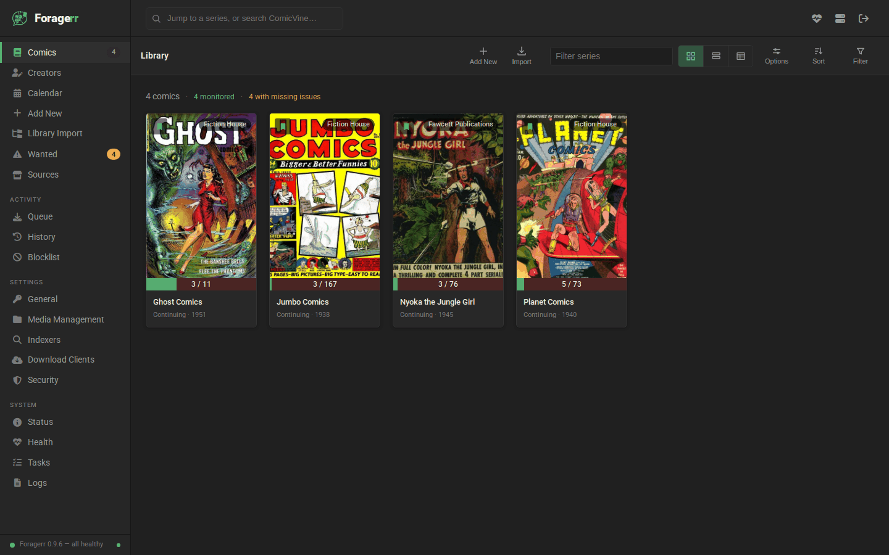
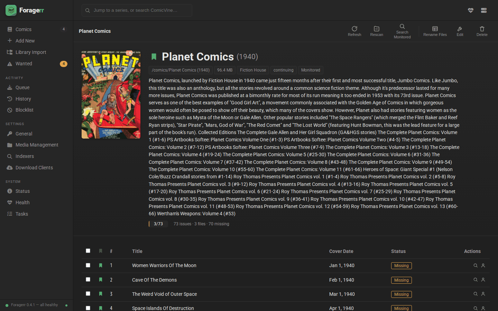
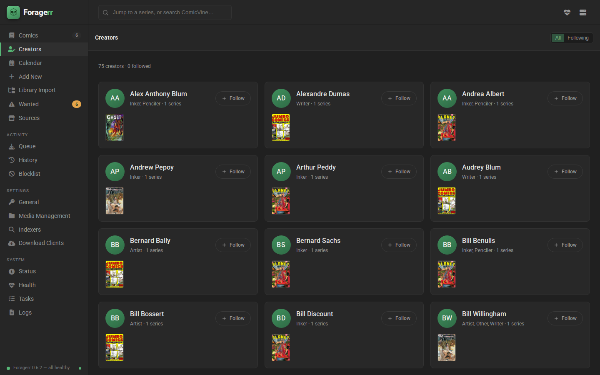
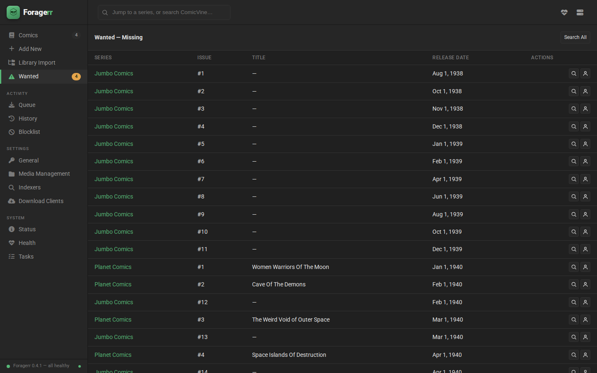
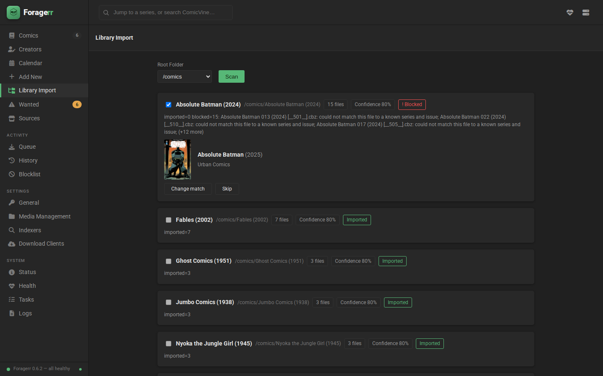
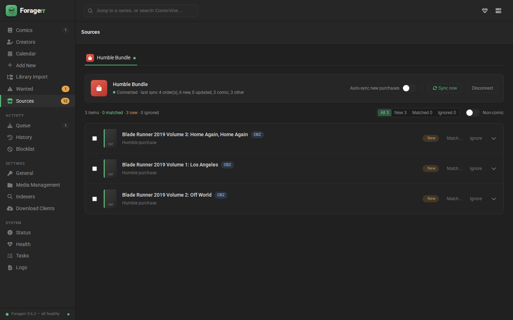
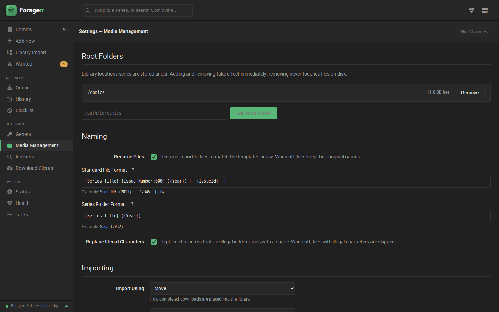

# foragerr

> **AI-built, human-directed.** foragerr's code, tests, and documentation are
> written almost entirely by AI (Anthropic's Claude), working under the
> spec-driven, requirement-traced process described below, with direction,
> review, and approval by the project's one human operator. That is as much
> the point of the project as the product is — it demonstrates disciplined
> AI-driven development of a real application — but weigh the software
> accordingly: it is young, it is AI-authored, and no human has read every
> line. The requirement registry, traceability matrix, per-change review
> gates, and release records in this repository are the honest account of
> how it was made.

foragerr is a self-hosted, Sonarr-style manager for a comic library you own. It
imports and renames an existing collection (DRM-free purchases such as Humble
Bundle drops, public-domain scans from the Digital Comic Museum and the Internet
Archive), matches it against ComicVine metadata, tracks which issues you have and
which are missing, and serves the library to your reading device over OPDS — for
example an iPad over Tailscale. Filling gaps integrates with your existing usenet
tooling (Newznab indexers, SABnzbd). There is no built-in reader.

It runs on one operator's home server behind a mandatory login, and is best
deployed tailnet-only rather than exposed to the open internet (see
Installation) — and it doubles as a working demonstration
of regulated software development practice applied to a small, real project (see
the formicary.ai context this project is developed under). That second purpose is
why the tour below links every screen to the requirements that govern it.

This file is foragerr's top-level labelling and technical documentation: what the
project is, how it is developed and secured, and where to find more detail. For
day-to-day usage and configuration, see the [manual](docs/manual/index.md).

## Stack

- **Backend**: Python (FastAPI), SQLite.
- **Frontend**: React + TypeScript single-page app, served by the backend.
- **Deployment**: a single Docker image built to linuxserver.io conventions
  (see Installation below).

## A tour of the application

Every foragerr feature is governed by registered requirements
(`FRG-<AREA>-<NNN>`), each carried by at least one tagged test — the captions
below link each screen to its requirements in the
[registry](docs/traceability/requirements-registry.md), the governing spec, and
the manual page that documents it. The demo library shown is public-domain
golden-age comics (Fiction House and Fawcett titles) from the Internet Archive.

### Library



*Library index screen — [FRG-UI-003](docs/traceability/requirements-registry.md),
[FRG-SER-009](docs/traceability/requirements-registry.md) · spec:
[ui](openspec/specs/ui/spec.md), [ser](openspec/specs/ser/spec.md) · manual:
[library](docs/manual/user/library.md)*

### Series detail



*Series detail screen — [FRG-UI-004](docs/traceability/requirements-registry.md),
[FRG-SER-003](docs/traceability/requirements-registry.md) · spec:
[ui](openspec/specs/ui/spec.md), [ser](openspec/specs/ser/spec.md) · manual:
[library](docs/manual/user/library.md)*

### Creators



*Creators grid and follows —
[FRG-UI-027](docs/traceability/requirements-registry.md),
[FRG-CRTR-001](docs/traceability/requirements-registry.md) · spec:
[ui](openspec/specs/ui/spec.md), [crtr](openspec/specs/crtr/spec.md) · manual:
[web-ui](docs/manual/user/web-ui.md)*

### Wanted issues



*Wanted screen and backlog search —
[FRG-UI-011](docs/traceability/requirements-registry.md),
[FRG-SRCH-009](docs/traceability/requirements-registry.md) · spec:
[ui](openspec/specs/ui/spec.md), [srch](openspec/specs/srch/spec.md) · manual:
[search](docs/manual/user/search.md)*

### Importing an existing collection



*Existing-library import with staged review —
[FRG-UI-015](docs/traceability/requirements-registry.md),
[FRG-IMP-023](docs/traceability/requirements-registry.md) · spec:
[ui](openspec/specs/ui/spec.md), [imp](openspec/specs/imp/spec.md) · manual:
[import](docs/manual/user/import.md)*

### Sources



*Store sources — connect a Humble Bundle account with a pasted session cookie
and review purchases before they enter the library —
[FRG-UI-029](docs/traceability/requirements-registry.md),
[FRG-SRC-001](docs/traceability/requirements-registry.md) · spec:
[ui](openspec/specs/ui/spec.md), [sources](openspec/specs/sources/spec.md) ·
manual: [sources](docs/manual/user/sources.md)*

### Media management



*Media management and naming settings —
[FRG-UI-012](docs/traceability/requirements-registry.md),
[FRG-PP-009](docs/traceability/requirements-registry.md) · spec:
[ui](openspec/specs/ui/spec.md), [pp](openspec/specs/pp/spec.md) · manual:
[configuration](docs/manual/admin/configuration.md)*

### Reading over OPDS

The library is also served as an OPDS catalog (with page streaming) that any
OPDS-capable reader app can browse — foragerr itself has no reader UI, so there
is no screenshot to show; point your reader at `/opds`.

*OPDS catalog and page streaming —
[FRG-OPDS-001](docs/traceability/requirements-registry.md) · spec:
[opds](openspec/specs/opds/spec.md) · manual:
[reading-opds](docs/manual/user/reading-opds.md)*

## Security & regulatory posture

foragerr is developed under a written development-process specification
(`openspec/specs/dev-process/spec.md`) that treats several things a regulated
software project would treat as controlled artifacts:

- **Spec before code.** No production code is written without a governing OpenSpec
  change proposal containing the requirements it implements, approved by the
  project owner before implementation begins.
- **Requirement traceability.** Every requirement has a stable, never-reused ID
  (`FRG-<AREA>-<NNN>`, registered in
  `docs/traceability/requirements-registry.md`) and at least one test tagged with
  that ID. The traceability matrix (`docs/traceability/matrix.md`) is regenerable
  from the registry, test tags, and commit trailers — not hand-maintained.
- **Threat modelling and a risk register.** New attack surface (a listener, a parser
  of untrusted input, credentials, an outbound integration) requires an update to
  `docs/security/threat-model.md` (STRIDE analysis) and `docs/security/risk-register.md`
  in the same change that introduces it. Accepted risks (for example, the
  recommendation to keep foragerr on a tailnet rather than the open internet —
  see `docs/manual/admin/network.md`) are recorded there with an owner, a
  rationale, and a review trigger, not silently deferred.
- **A SOUP register.** Third-party runtime dependencies are tracked as SOUP
  (Software of Unknown Provenance, in IEC 62304 terms) in
  `docs/security/soup-register.md`: version constraint, source, purpose, and
  license per dependency, kept in sync whenever a dependency is added, removed,
  or upgraded. Systematic anomaly/vulnerability review is deferred until
  network-connected CI exists (see the register's methodology note).
- **A manual kept in sync with the application.** `docs/manual/` is a controlled
  artifact: a change that alters documented behavior updates the affected manual
  section in the same change, before merge — see `docs/manual/index.md`'s currency
  statement for exactly what is covered as of today.

## Way of working

- **Specs are the source of truth.** `openspec/specs/` holds the baseline
  requirements per capability area; `openspec/changes/` holds in-flight change
  proposals (design + spec deltas + tasks) until they are implemented and archived
  back into the baseline.
- **Commits are traceable.** Every commit uses Conventional Commits format plus a
  mandatory `Refs: FRG-...` trailer citing the requirement IDs it touches, enforced
  by a commit-msg hook (`docs/process/commit-standard.md`).
- **Branches only; `main` stays green.** Nobody commits directly on `main`. Work
  happens on `change/<id>`, `research/<topic>`, or `process/<name>` branches and
  lands via `git merge --no-ff` only while the full test suite passes.
- **Spec approval gate.** Every OpenSpec proposal is explicitly approved by the
  project owner (recorded in the proposal's `## Approval` section) before any
  implementation work starts.
- **Every release is recorded.** Merges to `main` are tagged with SemVer, and each
  release carries a [`CHANGELOG.md`](CHANGELOG.md) entry, a matching `pyproject.toml`
  version, and a published GitHub Release (`docs/process/commit-standard.md`,
  FRG-PROC-013).

See `CLAUDE.md` and `docs/process/` for the full set of process rules and how they
are enforced.

## Installation

There is no published registry image — build it from the repository and run it
with one `/config` volume:

```bash
tools/build-image.sh --tag foragerr:latest   # secret-scans the context, then docker build
docker run -d --name foragerr \
  -e PUID=1000 -e PGID=1000 -e TZ=Europe/Amsterdam \
  -v /srv/foragerr/config:/config \
  -v /srv/media/comics:/comics \
  -v /srv/downloads:/downloads \
  -p 100.x.y.z:8789:8789 \
  foragerr:latest
```

Bind the port to your **tailnet address** (`100.x.y.z`), never a public
interface — foragerr does no TLS termination of its own, so Tailscale-only
remains the recommended exposure model even though every surface now requires
a login (`RISK-020`). foragerr also refuses to start on a fresh deployment
without a `FORAGERR_ADMIN_USER` / `FORAGERR_ADMIN_PASSWORD` pair, which seeds
the one operator account. Full instructions, a compose example, secrets
handling, and the network posture live in the admin manual:

- `docs/manual/admin/deployment.md` — image build, run, upgrade, health checks
- `docs/manual/admin/configuration.md` — every setting and its env override
- `docs/manual/admin/secrets.md` — API keys (ComicVine, indexers, SABnzbd)
- `docs/manual/admin/authentication.md` — mandatory login, bootstrap credentials
- `docs/manual/admin/network.md` — the Tailscale-only exposure model

## Roadmap

Planned-but-unshipped work lives in [the roadmap](docs/roadmap.md), the single
controlled document for forward-looking intentions; authoritative statuses are
in the [requirements registry](docs/traceability/requirements-registry.md).

## License & contributions

foragerr is free software under the GNU General Public License, version 3 or
(at your option) any later version (SPDX: GPL-3.0-or-later) — see
[LICENSE](LICENSE). It is **source-available as a demonstration, not a
community project**: a personal tool built for one operator's home server,
published so the development practice can be inspected rather than to seek
adoption. You are welcome to read, build, and fork it under the license. Issues
are open, but input is not solicited and may go unanswered; there is no support
expectation.
